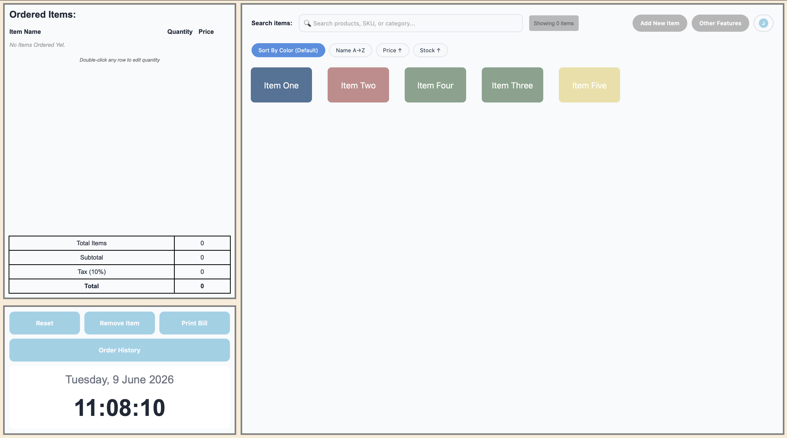
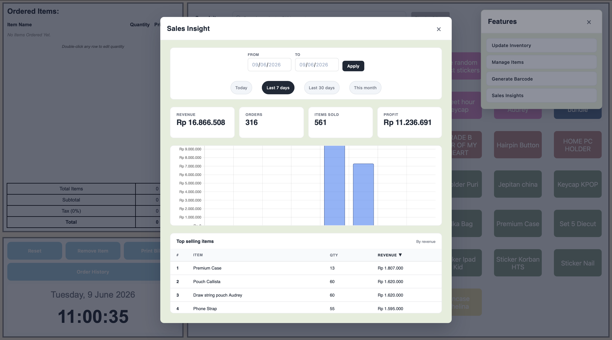
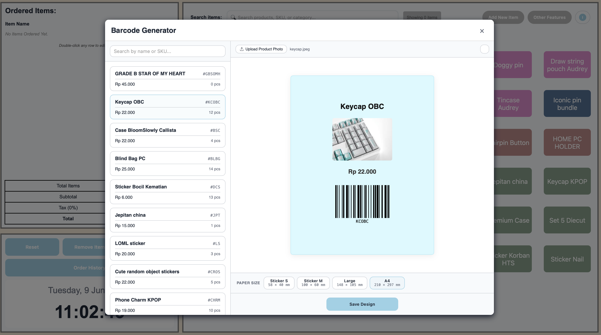
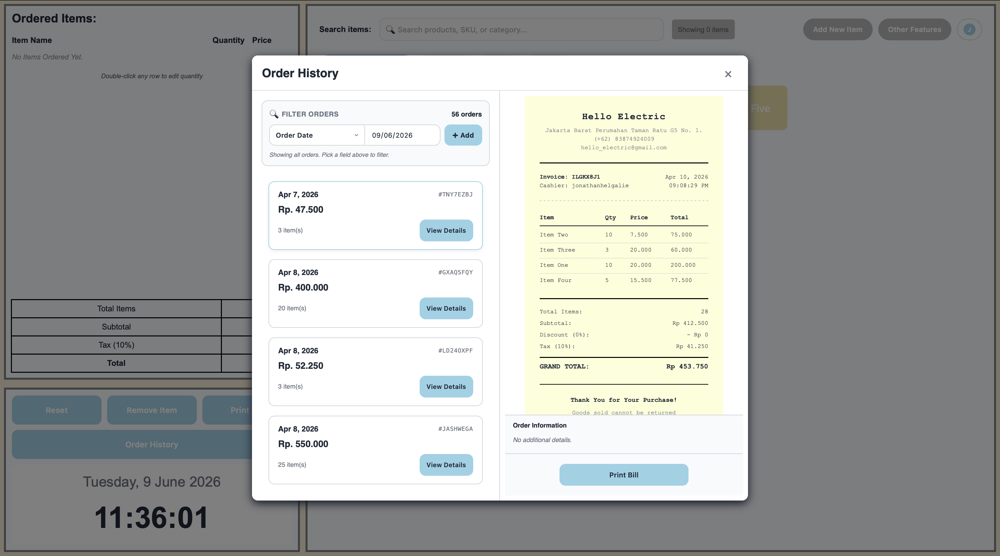

# POS FLOW

POS FLOW is a browser-based point-of-sale app for small retail shops. It handles the day-to-day counter workflow — ringing up sales, managing inventory, generating barcode labels, printing receipts, and reviewing sales — with everything synced to the cloud so the data isn't tied to a single machine.

**Live demo:** https://minipos-d9d92.web.app


*Caption: the main point-of-sale screen — a color-coded product grid on the right, and a live order cart on the left with running subtotal, tax, and total.*

It started as a real project for a small electrical-parts shop in Indonesia, migrated from an earlier offline Electron + MySQL desktop build to a web app so the shop could run it from any device with a browser. All amounts are in Indonesian Rupiah (IDR).

---

## Features

**Point of sale**
- Color-coded product grid; tap an item to add it to the order.
- Search products by name, SKU, or supplier, and sort by color, name, price, or stock.
- USB barcode scanner support — scanning a product's SKU adds it straight to the cart (no input field needs focus).
- Live order totals: subtotal, configurable tax, optional discount, and grand total update as you go.
- Stock is checked on every add, and submitting an order writes the order and decrements stock in a single atomic operation.

**Checkout**
- Attach a customer (saved and re-used by phone number) and an order note.
- Apply a percentage discount.
- Add ad-hoc custom fields per order (date, time, or multiple-choice) that are saved to a reusable library for next time.

**Inventory**
- Add items with SKU, cost/sell price, stock, unit of measure, minimum-stock threshold, supplier, and a color tag.
- Edit item details, and restock with safe concurrent updates.
- Low-stock items are flagged with a GOOD / ALERT badge against their minimum threshold.

**Barcode labels**
- Generate printable CODE128 labels from an item's SKU, with the product name, price, and an optional photo.
- Choose a label size (58×40 mm sticker up to A4) and export it as a high-resolution PNG.

**Receipts & order history**
- Thermal-receipt layout sized for 58 mm or 80 mm printers, with the shop's details, an itemized table, discount/tax breakdown, and a custom footer.
- Browse past orders and reprint any receipt through the browser.
- Filter order history by date, customer, phone, note, or any custom field you've used.

**Sales insights**
- Revenue, order count, items sold, and profit for a chosen date range (today, last 7/30 days, this month, or a custom range).
- A revenue-by-day chart and a sortable top-sellers table.

**Accounts & onboarding**
- Email sign-up with a 6-digit code that is generated and verified entirely on the server.
- A short setup wizard collects the business profile, tax rate, and printer settings before the first sale.
- Each owner's inventory, orders, and customers are isolated from every other account.

---

## Tech stack

| Area | Technology |
|------|------------|
| Frontend | Vanilla JavaScript (ES modules), Vite 6 |
| Backend | Node.js + Express 5 (used only for OTP email) |
| Database | Cloud Firestore |
| Auth | Firebase Authentication (email/password) + server-side OTP |
| Email | Nodemailer (Gmail SMTP), otp-generator |
| Charts | Chart.js |
| Barcodes | JsBarcode (CODE128) + html2canvas (PNG export) |
| API hardening | express-rate-limit |
| Hosting | Firebase Hosting (frontend) + Google Cloud Run (backend) |
| CI/CD | GitHub Actions |

---

## How it's built

The frontend is a single-page app written in plain JavaScript with no UI framework. All markup lives in one `index.html` (including `<template>` elements that are cloned for modals and the wizard), and each feature is an ES module with an `init*()` entry point that wires up its own DOM. Modules talk to each other through direct imports rather than a shared store or event bus.

A few decisions worth calling out:

- **Firebase from the browser.** All data and auth go directly to Firebase; `src/firebase.js` is the single place that touches Firestore and Auth. The Express server exists only to send and verify the sign-up OTP, so the one-time code never reaches the client.
- **Atomic orders.** Submitting an order uses a Firestore `writeBatch()` to create the order document and decrement each item's stock together — if anything fails, nothing is written.
- **Multi-tenant isolation.** Every record carries an `ownerId`, and `firestore.rules` enforces that a user can only read or write their own documents.
- **XSS-safe rendering.** Dynamic content is built with `createElement` / `textContent`; `innerHTML` is never used with user or database data.
- **Hardware-friendly.** A global keydown listener interprets a fast burst of keystrokes ending in Enter as a barcode scan, so a standard USB scanner works without any driver or SDK.

---

## Screenshots


*Caption: the sales dashboard — revenue, orders, items sold, and profit for a date range, with a revenue-by-day chart and a sortable top-sellers table.*


*Caption: the barcode label generator — pick an item, add a photo and price, choose a label size, and export a print-ready CODE128 label as a PNG.*


*Caption: order history with a thermal-receipt preview — browse and filter past orders, then reprint any bill.*

---

## Getting started

### Prerequisites

- Node.js 18+ (20 recommended)
- A Firebase project with Firestore and Email/Password authentication enabled
- A Gmail account with an [App Password](https://support.google.com/accounts/answer/185833) for sending OTP emails

### Setup

```bash
git clone https://github.com/Jonathanhelga/POSflow.git
cd POSflow
npm install
```

Create a `.env` file in the project root:

```env
EMAIL_USER=your-gmail-address@gmail.com
EMAIL_PASS=your-gmail-app-password
VITE_FIREBASE_API_KEY=your-firebase-web-api-key
VITE_SERVER_URL=http://localhost:3000
```

Then point the app at your own Firebase project:

- Update the Firebase config in `src/firebase.js` (the API key is read from `VITE_FIREBASE_API_KEY`; the other values are inline).
- Add a Firebase Admin service-account key at `server/serviceAccountKey.json` so the backend can write OTP codes.
- Deploy the security rules and indexes: `firebase deploy --only firestore`.

> The Firebase config, `.env`, and service-account key in my own setup are tied to my project and are gitignored, so running your own instance means supplying your own Firebase project and credentials.

---

## Running locally

```bash
npm run dev
```

This starts the Vite frontend and the Express backend together:

- Frontend: http://localhost:5173
- Backend API: http://localhost:3000

| Command | What it does |
|---------|--------------|
| `npm run dev` | Frontend + backend together |
| `npm run client` | Vite dev server only |
| `npm run server` | Express backend only |
| `npm run build` | Production build to `dist/` |
| `npm run preview` | Preview the production build |

There is no test runner, linter, or formatter configured.

---

## Project structure

```
.
├── index.html              # SPA shell + all <template> markup
├── src/                    # one module per feature area
│   ├── main.js             # entry point: auth state → boots the app
│   ├── firebase.js         # the only module that talks to Firestore/Auth
│   ├── order-add_item.js   # order cart + atomic submission
│   ├── search_item.js      # product search + USB scanner listener
│   ├── inventory_update.js # restock panel
│   ├── manage-item.js      # edit item details
│   ├── add_item_ui.js      # add a new item
│   ├── barcode-generator.js# label designer + PNG export
│   ├── order_history.js    # past orders + receipt preview + print
│   ├── sales_insight.js    # analytics dashboard (Chart.js)
│   ├── customer_checkout.js# checkout modal
│   └── ...                 # auth, wizard, profile, helpers
├── styles/                 # per-feature CSS + variables.css (design tokens)
├── server/                 # Express OTP API (+ Dockerfile for Cloud Run)
├── docs/                   # setup notes + screenshots
├── firestore.rules         # per-user data isolation
└── firestore.indexes.json  # composite indexes
```

---

## Deployment

- **Frontend** → Firebase Hosting: `npm run build && firebase deploy --only hosting`.
- **Backend** → Google Cloud Run: the Express server is containerized (`server/Dockerfile`) and deployed as a service in `asia-east1`.
- **CI/CD**: GitHub Actions redeploys the affected side on pushes to `main`, and posts a Hosting preview link on pull requests.

See `DEPLOYMENT_NOTES.md` for the full walk-through.

---

## Notes

A few honest caveats:

- No automated tests yet — the app has been validated by hand.
- The JS bundle is around 1 MB (most of it the Firebase SDK); there's no code-splitting yet.
- The API currently allows all origins (CORS), which is fine for the demo but would be locked to the frontend origin for a real production deployment.
- Amounts are IDR only.

---

## License

ISC (see `package.json`).
